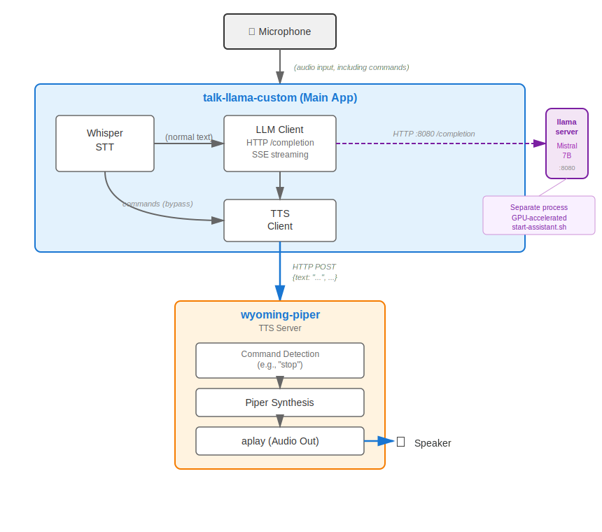

# Voice Assistant with Custom Commands

A voice assistant system combining Speech-to-Text (Whisper), LLM (LLaMA), and Text-to-Speech (Piper TTS) with support for LLM-bypass custom commands.

## Key Features

- **Speech-to-Text**: Real-time speech recognition using Whisper
- **LLM Conversation**: Natural language processing using LLaMA
- **Text-to-Speech**: High-quality speech synthesis using Piper
- **Custom Commands**: Commands that bypass the LLM for instant execution
  - **Interruptibility**: Say "stop" to interrupt the AI while speaking
  - **Extensible**: Framework for adding more direct commands

## Architecture



<details>
<summary>View ASCII diagram</summary>

```
                    ┌──────────────┐
                    │  Microphone  │
                    └──────┬───────┘
                           │ (audio input, including commands)
                           ▼
┌──────────────────────────────────────────────────────────┐
│              talk-llama-custom (Main App)                │
│                                                          │
│  ┌──────────┐                ┌────────┐                 │
│  │ Whisper  │───────────────▶│ LLaMA  │                 │
│  │   STT    │  (normal text) │  LLM   │                 │
│  └────┬─────┘                └────┬───┘                 │
│       │                           │                     │
│       │                           ▼                     │
│       │                      ┌────────┐                 │
│       │   commands (bypass   │  TTS   │◀────────────────┘
│       └─────────────────────▶│ Client │                 │
│                              └────┬───┘                 │
│                                   │                     │
│                                   │ HTTP POST           │
│                                   │ {text: "...", ...}  │
└───────────────────────────────────┼─────────────────────┘
                                    │
                                    ▼
                         ┌──────────────────────────┐
                         │   wyoming-piper          │
                         │   TTS Server             │
                         │                          │
                         │  ┌────────────────────┐  │
                         │  │ Command Detection  │  │
                         │  │ (e.g., "stop")     │  │
                         │  └─────────┬──────────┘  │
                         │            │             │
                         │            ▼             │
                         │  ┌────────────────────┐  │
                         │  │  Piper Synthesis   │  │
                         │  └─────────┬──────────┘  │
                         │            │             │
                         │            ▼             │
                         │  ┌────────────────────┐  │
                         │  │  aplay (Audio Out) │──┼──▶ 🔊 Speaker
                         │  └────────────────────┘  │
                         └──────────────────────────┘
```
</details>

## Repository Structure

This repository uses **git submodules** for upstream dependencies to keep only custom code in the main repo:

```
voice-assistant-custom-commands/
├── whisper.cpp/              # Submodule: Upstream Whisper STT engine
├── wyoming-piper/            # Custom Wyoming-Piper (wyoming-piper-custom)
│   ├── wyoming_piper/        # Modified source files
│   │   ├── __main__.py       # Entry point (test mode, custom logging)
│   │   ├── handler.py        # Event handler (stop cmd, test mode)
│   │   └── process.py        # Process manager (aplay support)
│   ├── pyproject.toml        # Package config (renamed to wyoming-piper-custom)
│   └── MODIFICATIONS.md      # Documentation of all changes
├── custom/                   # Your custom modifications
│   └── talk-llama/           # Modified talk-llama application
│       ├── talk-llama.cpp    # Main application (TTS fixes, test mode)
│       ├── llama.cpp         # Full LLaMA inference engine
│       ├── llama.h           # LLaMA API header
│       └── MODIFICATIONS.md  # Documentation of changes
├── tests/                    # Test harness
│   ├── audio_generator.py    # Piper TTS test audio generator
│   ├── audio_verifier.py     # Whisper STT output verifier
│   ├── run_tests.py          # Test orchestrator
│   ├── test_cases.yaml       # Test definitions
│   └── README.md             # Test harness documentation
├── CMakeLists.txt            # Build configuration
└── README.md                 # This file
```

## What's Custom vs Upstream

### 🎯 Custom Code (This Repo)

**talk-llama modifications** (`custom/talk-llama/`):
- **talk-llama.cpp** - Main application with:
  - TTS crash bugfixes (safe string handling, CURL error checking)
  - Test mode support (`--test-input` for automated testing)
  - Skip warmup transcription in test mode
  - Debug output and proper cleanup
- **llama.cpp/llama.h** - Full LLaMA inference engine from llama.cpp repo
- See `custom/talk-llama/MODIFICATIONS.md` for details

**Wyoming-Piper Custom** (`wyoming-piper/`):
- Custom fork of Wyoming-Piper named **wyoming-piper-custom**
- Based on upstream Wyoming-Piper with custom modifications
- Installs as separate package to avoid conflicts with standard wyoming-piper
- Key modifications:
  - **__main__.py** - Test mode arguments, reduced logging verbosity
  - **handler.py** - Stop command detection, test mode, aplay playback
  - **process.py** - Audio process management with aplay support
  - **pyproject.toml** - Package name changed to wyoming-piper-custom
- See `wyoming-piper/MODIFICATIONS.md` for complete documentation

**Test harness** (`tests/`):
- Complete end-to-end testing framework
- Synthetic audio generation + verification
- See `tests/README.md` for documentation

### 📦 Upstream Dependencies (Submodules)

**whisper.cpp**:
- Whisper STT engine and GGML backend
- Locked at commit: `d207c688` (whisper.cpp v1.5.5 era)
- Source: https://github.com/ggerganov/whisper.cpp
- Includes: Whisper models, GGML tensor library, examples

## Prerequisites

### System Requirements
- Linux (Ubuntu/Debian recommended) or Windows with WSL
- Python 3.9+
- C++ compiler (gcc/g++ 8+)
- CMake 3.12+
- ROCm 5.x+ (optional, for AMD GPU acceleration)
- Audio system with ALSA (`aplay` command)

### Dependencies

**Required packages:**
```bash
# Ubuntu/Debian
sudo apt-get update
sudo apt-get install -y \
    build-essential \
    cmake \
    git \
    libsdl2-dev \
    libcurl4-openssl-dev \
    libcjson-dev \
    alsa-utils \
    python3 \
    python3-pip \
    pipx

# Optional: ROCm for AMD GPU acceleration
# Follow AMD ROCm installation guide: https://rocm.docs.amd.com/
```

## Setup

### 1. Clone with Submodules

```bash
git clone --recursive https://github.com/pmamd/voice-assistant-custom-commands.git
cd voice-assistant-custom-commands
```

If you already cloned without `--recursive`:
```bash
git submodule update --init --recursive
```

### 2. Build the Voice Assistant

**Easy build using Makefile (recommended):**
```bash
# Build everything (talk-llama + Piper TTS)
make all

# Or build just the main executable
make talk-llama

# Run test suite
make test

# See all options
make help
```

**Manual build using CMake:**
```bash
# CPU-only build
cmake -B build -DWHISPER_SDL2=ON
cmake --build build -j

# GPU build (ROCm for AMD GPUs)
cmake -B build -DWHISPER_SDL2=ON -DGGML_HIPBLAS=ON
cmake --build build -j
```

The executable will be at: `build/bin/talk-llama-custom`

### 3. Download Models

**Whisper Model:**
```bash
cd whisper.cpp/models
# English (150MB)
bash download-ggml-model.sh base.en

# Multilingual (150MB)
bash download-ggml-model.sh base

# Better quality (1.5GB)
bash download-ggml-model.sh medium
```

**LLaMA Model:**
Download a GGUF model (e.g., Mistral 7B):
```bash
# Example: Mistral 7B Instruct Q5_0 (~5GB)
wget https://huggingface.co/TheBloke/Mistral-7B-Instruct-v0.2-GGUF/resolve/main/mistral-7b-instruct-v0.2.Q5_0.gguf
```

### 4. Setup Wyoming-Piper TTS Server

```bash
# Install wyoming-piper-custom using the install script
./install-wyoming.sh

# Or manually with pipx (recommended)
cd wyoming-piper
pipx install -e .
cd ..

# Or manually with pip
cd wyoming-piper
pip install -e .
cd ..
```

The `wyoming-piper/` directory contains our custom fork with all modifications already applied. It installs as `wyoming-piper-custom` to avoid conflicts with standard wyoming-piper.

## Usage

### 1. Start the TTS Server

```bash
cd wyoming-piper
python3 -m wyoming_piper \
    --piper /usr/bin/piper \
    --uri tcp://0.0.0.0:8020 \
    --voice en_US-lessac-medium
```

The server will auto-download the voice model on first run.

### 2. Run the Voice Assistant

```bash
cd build/bin
./talk-llama-custom \
    -m /path/to/mistral-7b-instruct-v0.2.Q5_0.gguf \
    --model-whisper ../../whisper.cpp/models/ggml-base.en.bin \
    --xtts-url http://localhost:8020/ \
    --xtts-voice emma_1 \
    -p "You are a helpful AI assistant."
```

### 3. Interact

- **Speak** into your microphone
- The AI will **respond** with speech
- Say **"stop"** to interrupt the AI mid-sentence
- Press **Ctrl+C** to exit

## Custom Commands

### Current Commands

- **"stop"** - Interrupts AI speech output

### Adding New Commands

To add custom LLM-bypass commands:

1. Edit `custom/talk-llama/talk-llama.cpp`
2. Add detection logic in the speech processing loop
3. Route to appropriate handler instead of LLaMA
4. Optionally add server-side handling in `wyoming-piper/`

Example command categories:
- **Control commands**: stop, pause, resume, repeat
- **System commands**: volume up/down, mute
- **Quick queries**: what time, what date
- **App control**: exit, restart, help

## Deployment

This section documents deployment to a fresh target machine based on real-world deployment experience.

### Prerequisites

**IMPORTANT**: You will need sudo access on the target machine to install system packages.

**Target machine requirements**:
- Linux (Ubuntu/Debian recommended)
- SSH access configured
- At least 8GB RAM (for LLM inference)
- 10GB free disk space (for models)
- Audio output device (speakers or headphones)

### Step-by-Step Deployment

#### 1. Clone Repository on Target Machine

SSH into the target machine and clone the repository:

```bash
# SSH into target
ssh user@target-machine

# Clone repository with submodules
git clone --recursive https://github.com/YOUR_USERNAME/voice-assistant-custom-commands.git
cd voice-assistant-custom-commands
```

**Common Issues**:
- If `whisper.cpp` directory is empty: Run `git submodule update --init --recursive`
- If clone fails with submodule errors: Check that all submodule URLs are accessible

#### 2. Install System Dependencies

**REQUIRES SUDO ACCESS**

```bash
sudo apt-get update
sudo apt-get install -y \
    build-essential \
    cmake \
    git \
    libsdl2-dev \
    libcurl4-openssl-dev \
    libcjson-dev \
    alsa-utils \
    python3 \
    python3-pip \
    pipx
```

**Package Notes**:
- `libsdl2-dev`: Required for audio capture in talk-llama
- `libcurl4-openssl-dev`: Required for HTTP TTS requests
- `libcjson-dev`: Required for JSON parsing (easily missed!)
- `pipx`: Recommended for isolated Python package installation
- `alsa-utils`: Provides `aplay` command for audio playback

**Common Issues**:
- **"libcjson-dev not found"**: This package is critical but often not documented. Without it, build will fail with `cJSON.h not found`.
- **"pipx not found"**: Fall back to `pip` if `pipx` is unavailable, but isolated installation is recommended.

#### 3. Build the Application

```bash
# CPU-only build
cmake -B build -DWHISPER_SDL2=ON
cmake --build build -j

# GPU build (ROCm for AMD GPUs)
cmake -B build -DWHISPER_SDL2=ON -DGGML_HIPBLAS=ON
cmake --build build -j
```

**Expected output**: Executable at `build/bin/talk-llama-custom`

**Common Issues**:
- **CMake fails with "SDL2 not found"**: Install `libsdl2-dev`
- **Linker error "cannot find -lcurl"**: Install `libcurl4-openssl-dev`
- **"cJSON.h not found"**: Install `libcjson-dev` (most commonly missed!)
- **Build hangs or slow**: Use `-j` to parallelize build

#### 4. Install Wyoming-Piper TTS

```bash
# Install wyoming-piper-custom using pipx (recommended)
./install-wyoming.sh

# Or manually with pipx
cd wyoming-piper
pipx install -e .
cd ..

# Or manually with pip (if pipx unavailable)
cd wyoming-piper
pip install -e .
cd ..
```

**Verify installation**:
```bash
which wyoming-piper-custom
wyoming-piper-custom --version
```

**Common Issues**:
- **"wyoming-piper-custom: command not found"**:
  - Ensure pipx bin directory is in PATH: `export PATH="$HOME/.local/bin:$PATH"`
  - Add to `~/.bashrc` for persistence
- **"ModuleNotFoundError: No module named 'wyoming'"**: Dependencies not installed, re-run install

#### 5. Download Models

**Whisper Model** (for speech-to-text):
```bash
cd whisper.cpp/models
bash download-ggml-model.sh base.en  # English-only, 150MB
# Or for better quality:
# bash download-ggml-model.sh medium  # Multilingual, 1.5GB
cd ../..
```

**LLaMA Model** (for conversation):
```bash
# Example: Download Mistral 7B Instruct Q5_0 (~5GB)
wget https://huggingface.co/TheBloke/Mistral-7B-Instruct-v0.2-GGUF/resolve/main/mistral-7b-instruct-v0.2.Q5_0.gguf

# Or download to a models directory
mkdir -p models
cd models
wget https://huggingface.co/TheBloke/Mistral-7B-Instruct-v0.2-GGUF/resolve/main/mistral-7b-instruct-v0.2.Q5_0.gguf
cd ..
```

**Common Issues**:
- **Downloads are slow**: Use `wget -c` to resume interrupted downloads
- **Out of disk space**: Check available space with `df -h` before downloading large models

#### 6. Test Audio System

**CRITICAL**: Verify audio output works before running the full system.

```bash
# List audio devices
aplay -l

# Test playback
aplay /usr/share/sounds/alsa/Front_Center.wav
```

**Common Issues**:
- **"aplay: command not found"**: Install `alsa-utils`
- **"No such file or directory" for test sound**: Use your own WAV file or skip this test
- **No sound output**: Check speaker connection, volume settings, and default audio device

#### 7. Start the TTS Server

In a dedicated terminal or screen session:

```bash
# Start Wyoming-Piper TTS server
wyoming-piper-custom \
    --piper /usr/bin/piper \
    --uri tcp://0.0.0.0:8020 \
    --voice en_US-lessac-medium
```

**Expected output**:
```
INFO:wyoming_piper:Ready
```

**The server will auto-download the voice model on first run** (~50-100MB).

**Common Issues**:
- **"piper: command not found"**:
  - Install Piper: `wget -O piper.tar.gz <piper-release-url> && tar -xvf piper.tar.gz`
  - Or use the included Piper in `external/piper/` (see README in that directory)
- **Port 8020 already in use**: Change to different port with `--uri tcp://0.0.0.0:8021`
- **Model download fails**: Check internet connectivity, try manual download

#### 8. Run the Voice Assistant

In a second terminal:

```bash
cd build/bin
./talk-llama-custom \
    -m ../../models/mistral-7b-instruct-v0.2.Q5_0.gguf \
    --model-whisper ../../whisper.cpp/models/ggml-base.en.bin \
    --xtts-url http://localhost:8020/ \
    --xtts-voice emma_1 \
    -p "You are a helpful AI assistant."
```

**Expected output**:
```
whisper_init_from_file_with_params_no_state: loading model from '../../whisper.cpp/models/ggml-base.en.bin'
...
system_info: n_threads = 4 / 8 | AVX = 1 | ...
[Start speaking]
```

**Common Issues**:
- **"Failed to initialize audio capture"**: Check microphone is connected and permissions
- **"Failed to load model"**: Verify model path is correct
- **"Connection refused to TTS server"**: Ensure Wyoming-Piper is running on port 8020
- **Constant "Speech started/ended" messages**: This is normal for background noise detection

#### 9. Test the System

1. **Say "Hello"** - Should hear AI response
2. **Say "What is two plus two"** - Should answer "four"
3. **Say "Stop"** - Should interrupt AI mid-sentence
4. **Press Ctrl+C** - Should exit cleanly

### Deployment Checklist

Use this checklist to verify successful deployment:

- [ ] Repository cloned with `git clone --recursive`
- [ ] All system packages installed (especially `libcjson-dev`!)
- [ ] Build completed successfully (`build/bin/talk-llama-custom` exists)
- [ ] Wyoming-Piper installed (`wyoming-piper-custom --version` works)
- [ ] Whisper model downloaded (`whisper.cpp/models/ggml-base.en.bin` exists)
- [ ] LLaMA model downloaded (e.g., `models/mistral-7b-instruct-v0.2.Q5_0.gguf`)
- [ ] Audio output tested (`aplay` works)
- [ ] TTS server running (Wyoming-Piper on port 8020)
- [ ] Voice assistant responds to speech
- [ ] Stop command works

### Deployment Scripts

For repeated deployments, consider creating deployment scripts:

**deploy.sh**:
```bash
#!/bin/bash
set -e

echo "Installing system dependencies..."
sudo apt-get update && sudo apt-get install -y \
    build-essential cmake git libsdl2-dev libcurl4-openssl-dev \
    libcjson-dev alsa-utils python3 python3-pip pipx

echo "Building talk-llama-custom..."
cmake -B build -DWHISPER_SDL2=ON
cmake --build build -j

echo "Installing Wyoming-Piper..."
./install-wyoming.sh

echo "Deployment complete! Download models and run start-assistant.sh"
```

### Remote Deployment

For deploying to remote machines:

```bash
# From local machine, deploy to remote target
rsync -avz --exclude build --exclude models \
    ./ user@target-machine:~/voice-assistant/

ssh user@target-machine "cd voice-assistant && ./deploy.sh"
```

**Note**: Models are large (5-6GB total), so exclude from rsync and download directly on target.

## Configuration

### Build Options

```bash
# Enable SDL2 (required for talk-llama)
-DWHISPER_SDL2=ON

# Enable ROCm/HIP acceleration (AMD GPUs)
-DGGML_HIPBLAS=ON

# Enable OpenBLAS
-DWHISPER_OPENBLAS=ON

# Enable Core ML (macOS)
-DWHISPER_COREML=ON
```

### Runtime Options

See `./talk-llama-custom --help` for all options. Common ones:

```bash
# Model paths
-m <path>              # LLaMA model path
--model-whisper <path> # Whisper model path

# TTS configuration
--xtts-url <url>       # TTS server URL (default: http://localhost:8020/)
--xtts-voice <name>    # Voice/speaker name

# LLM parameters
-p <prompt>            # System prompt
-c <size>              # Context size (default: 2048)
--temp <value>         # Temperature (default: 0.8)

# Audio settings
--language <lang>      # Language code (default: en)
--vad-thold <value>    # Voice activity detection threshold
```

## Development

### Updating Whisper.cpp

```bash
cd whisper.cpp
git fetch origin
git checkout <new-commit-hash>
cd ..
git add whisper.cpp
git commit -m "Update whisper.cpp to <version>"
```

### Modifying Custom Code

All your modifications should go in:
- `custom/talk-llama/` - For main application changes
- `wyoming-piper/` - For TTS server changes

```bash
# After making changes
cd custom/talk-llama
# Edit talk-llama.cpp
cd ../..
cmake --build build -j
```

### Viewing Differences from Upstream

```bash
# See what's different from base whisper.cpp example
cd whisper.cpp/examples/talk-llama
diff -u talk-llama.cpp ../../../custom/talk-llama/talk-llama.cpp
```

## Troubleshooting

### Submodule Issues

If whisper.cpp is empty after cloning:
```bash
git submodule update --init --recursive
```

### Build Errors

Missing SDL2:
```bash
sudo apt-get install libsdl2-dev
```

Missing CURL:
```bash
sudo apt-get install libcurl4-openssl-dev
```

### TTS Connection Issues

Test server connectivity:
```bash
curl -X POST http://localhost:8020/tts_to_audio/ \
  -H "Content-Type: application/json" \
  -d '{"text":"hello world","language":"en","speaker_wav":"emma_1"}'
```

### Audio Playback Issues

Test ALSA:
```bash
aplay -l                                    # List audio devices
aplay /usr/share/sounds/alsa/Front_Center.wav  # Test playback
```

## Known Limitations

1. **Platform**: Linux/WSL only (uses aplay for audio)
2. **Stop command**: Basic detection (just checks for "stop" in text < 10 chars)
3. **TTS interruption**: Not fully implemented (aplay waits for completion)
4. **Hardcoded paths**: Wyoming-piper has hardcoded local library path

## Contributing

Contributions welcome! Please:

1. Fork the repository
2. Create a feature branch
3. Make your changes (preferably in `custom/` directory)
4. Test thoroughly
5. Submit a pull request

## License

- **Custom code** (custom/, wyoming-piper modifications): Your license here
- **whisper.cpp**: MIT License - See whisper.cpp/LICENSE
- **Whisper models**: OpenAI
- **LLaMA models**: Meta AI (see individual model licenses)

## Credits

- **Whisper STT**: OpenAI
- **whisper.cpp**: Georgi Gerganov and contributors
- **LLaMA**: Meta AI
- **Piper TTS**: Rhasspy project
- **Wyoming Protocol**: Rhasspy project
- **talk-llama-fast**: Original modifications by Mozer
- **This project**: Paul Mobbs (2024-2026)

## Links

- **Upstream whisper.cpp**: https://github.com/ggerganov/whisper.cpp
- **talk-llama-fast** (inspiration): https://github.com/Mozer/talk-llama-fast
- **Wyoming-Piper**: https://github.com/rhasspy/wyoming-piper
- **Piper TTS**: https://github.com/rhasspy/piper

## Support

For issues:
1. Check the Troubleshooting section
2. Review logs from both talk-llama-custom and wyoming-piper
3. Open an issue with detailed error messages and steps to reproduce
