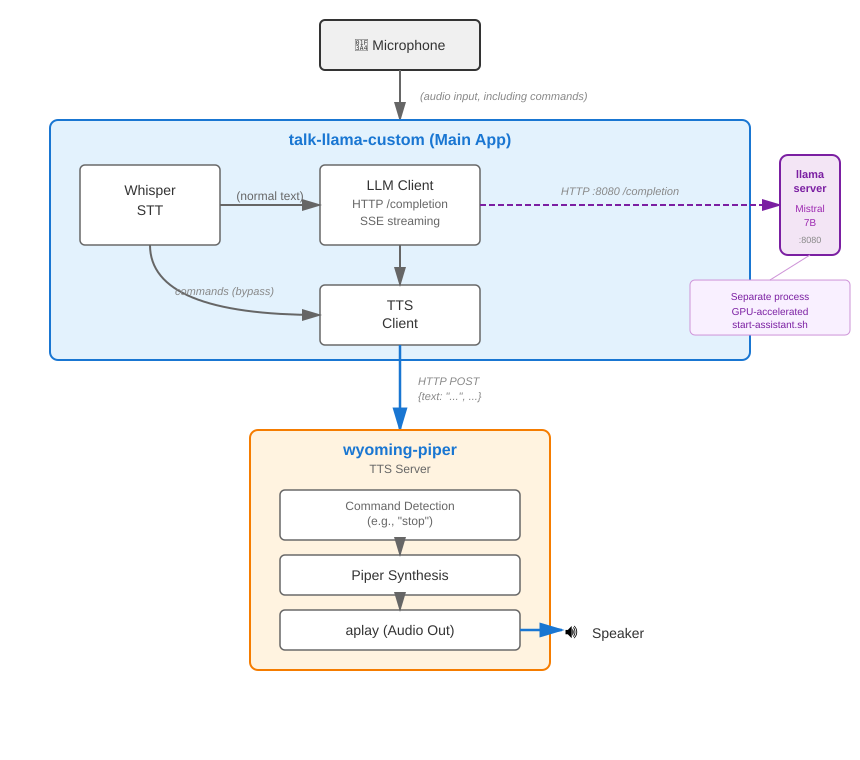

# Voice Assistant with Custom Commands

A voice assistant combining Whisper STT, Mistral LLM, and Piper TTS with a tool system for instant LLM-bypass commands — including interrupting speech mid-sentence.

## Features

- **Real-time speech recognition** — Whisper STT, runs locally
- **Natural conversation** — Mistral 7B or any GGUF-format LLM via llama.cpp
- **High-quality speech synthesis** — Piper TTS via Wyoming protocol
- **Interruptible** — say "stop" while the assistant is speaking and it stops immediately
- **Extensible tool system** — add new voice commands that bypass the LLM entirely
- **Background generation** — LLM runs in a background thread; assistant listens for commands the whole time

## Architecture



<details>
<summary>ASCII diagram</summary>

```
              ┌──────────────┐
              │  Microphone  │
              └──────┬───────┘
                     │
                     ▼
     ┌───────────────────────────────┐
     │    voice-assistant            │
     │                               │
     │  Whisper STT                  │
     │       │                       │
     │       ▼                       │
     │  [Fast path?] ──yes──▶ Execute tool immediately
     │       │ no                    │
     │       ▼                       │
     │  Mistral LLM  (background)    │
     │       │                       │
     │       ▼                       │
     │  TTS chunks ──────────────────┼──▶ Wyoming-Piper ──▶ aplay ──▶ 🔊
     │                               │
     └───────────────────────────────┘
              │ (main thread keeps listening)
              ▼
         "stop" detected ──▶ audio-stop event ──▶ aplay killed
```
</details>

## Quick Start

See **[QUICKSTART.md](./QUICKSTART.md)** for full installation and setup instructions.

The short version:
```bash
git clone --recursive https://github.com/pmamd/voice-assistant-custom-commands.git
cd voice-assistant-custom-commands

# Build voice-assistant
cmake -B build -DWHISPER_SDL2=ON && cmake --build build -j

# Build llama-server (required)
cd external/llama.cpp
cmake -B build -DGGML_HIP=ON -DGPU_TARGETS='gfx1102'  # or just -DGGML_HIP=ON for other GPUs
cmake --build build -j --target llama-server
cd ../..

# Start the assistant
./start-assistant.sh
```

## Repository Structure

```
voice-assistant-custom-commands/
├── src/                      # Application code
│   ├── talk-llama.cpp        # Main voice assistant application
│   ├── tool-system.h/.cpp    # Tool registry and executors
│   ├── tool-parser.h/.cpp    # Streaming Mistral tool call parser
│   ├── wyoming-client.h/.cpp # Wyoming protocol TCP client
│   └── tools/tools.json      # Tool definitions (JSON)
├── external/                 # Third-party dependencies
│   ├── whisper.cpp/          # Submodule: Whisper STT (AMD fork)
│   ├── wyoming-piper/        # Modified Wyoming-Piper TTS server
│   ├── piper/                # Submodule: Piper TTS models
│   └── llama.cpp/            # Submodule: llama-server (optional build)
├── tests/                    # Test suite
│   ├── run_tests.py          # End-to-end test runner
│   ├── test_real_interrupt.py    # Wyoming stop mechanics tests
│   └── test_wyoming_piper_unit.py # TTS output quality tests
├── docs/                     # Documentation
│   ├── TOOL_SYSTEM.md        # Tool calling architecture
│   ├── WYOMING.md            # Wyoming protocol integration
│   └── TTS_FEEDBACK_PREVENTION.md # VAD/echo mitigation
├── models/                   # GGUF models for LLM
├── start-assistant.sh        # Main startup script
├── QUICKSTART.md             # Installation and setup guide
└── CMakeLists.txt            # Build configuration
```

## Tool System

Voice commands are handled in two modes:

- **Fast path** — keyword-matched commands execute instantly, bypassing the LLM (e.g. "stop", "pause")
- **Smart path** — the LLM generates a structured `<tool_call>` response which is parsed and executed

Tools are defined in `src/tools/tools.json`. See [docs/TOOL_SYSTEM.md](./docs/TOOL_SYSTEM.md) for how to add new tools.

## Building

```bash
# CPU
cmake -B build -DWHISPER_SDL2=ON && cmake --build build -j

# AMD GPU (ROCm)
cmake -B build -DWHISPER_SDL2=ON -DGGML_HIPBLAS=ON && cmake --build build -j
```

## Running Tests

```bash
# Wyoming stop mechanics (requires Wyoming-Piper running)
python3 -m unittest tests.test_real_interrupt.TestWyomingStopMechanics -v

# Full test suite
python3 tests/run_tests.py --config tests/test_cases.yaml --group all
```

## Documentation

| File | Description |
|------|-------------|
| [QUICKSTART.md](./QUICKSTART.md) | Installation, setup, and troubleshooting |
| [docs/TOOL_SYSTEM.md](./docs/TOOL_SYSTEM.md) | Tool calling architecture and how to add tools |
| [docs/WYOMING.md](./docs/WYOMING.md) | Wyoming protocol integration details |
| [docs/TTS_FEEDBACK_PREVENTION.md](./docs/TTS_FEEDBACK_PREVENTION.md) | VAD/echo issues and mitigation |
| [docs/FUTURE.md](./docs/FUTURE.md) | Removed features worth re-adding |

## License

- **Custom code** (`src/`, `external/wyoming-piper/` modifications): see LICENSE
- **whisper.cpp**: MIT License — see `external/whisper.cpp/LICENSE`
- **Mistral models**: Mistral AI license — see model terms
- **LLaMA models**: Meta AI license — see model terms

## Credits

- **Whisper STT** — OpenAI
- **whisper.cpp** — Georgi Gerganov and contributors (MIT)
- **llama.cpp / LLaMA** — Georgi Gerganov / Meta AI
- **Mistral** — Mistral AI
- **Piper TTS** — Rhasspy project
- **Wyoming Protocol** — Rhasspy project
- **talk-llama-fast** — original modifications by Mozer
- **This project** — Paul Mobbs (2024–2026)

## Links

- [whisper.cpp (AMD fork with VitisAI NPU support)](https://github.com/amd/whisper.cpp)
- [talk-llama-fast](https://github.com/Mozer/talk-llama-fast) (inspiration)
- [Wyoming-Piper](https://github.com/rhasspy/wyoming-piper)
- [Piper TTS](https://github.com/rhasspy/piper)
