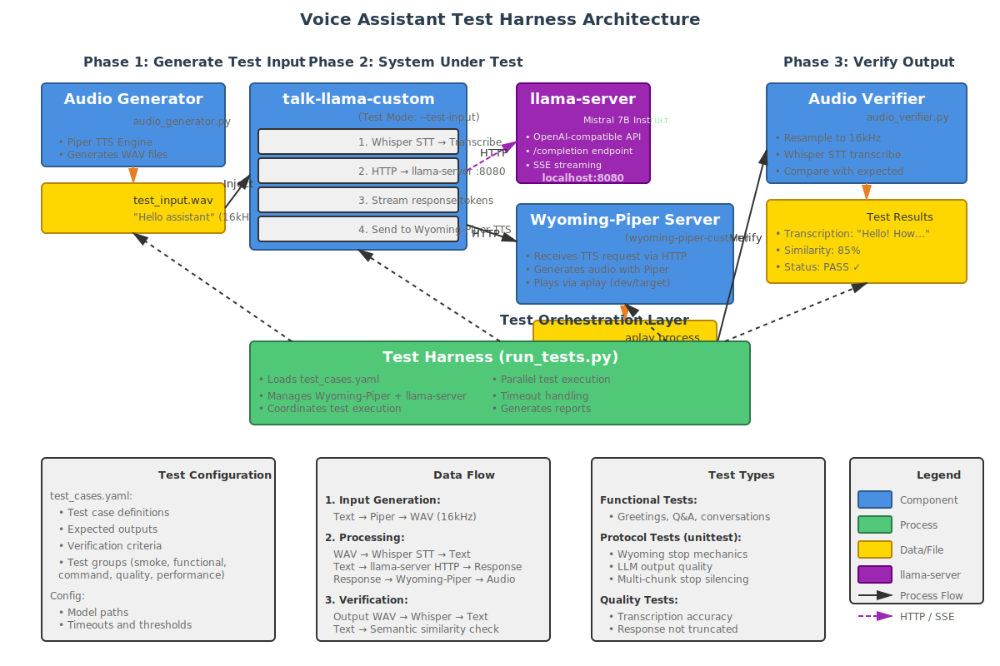

# Voice Assistant Test Harness

Comprehensive end-to-end testing framework for the voice assistant audio pipeline (Whisper STT → LLaMA → Piper TTS).



## Overview

This test harness provides automated verification of the complete voice assistant pipeline:
1. **Audio Generation**: Synthetic speech input using Piper TTS
2. **Speech Recognition**: Whisper STT transcription
3. **Response Generation**: LLaMA language model inference
4. **Text-to-Speech**: Piper TTS via Wyoming protocol
5. **Output Verification**: Whisper STT verification with fuzzy matching

## Architecture

### Components

#### 1. Audio Generator (`audio_generator.py`)
Generates synthetic test audio files using Piper TTS.

**Features**:
- Batch generation from test cases
- Support for multiple voices
- Configurable output directory
- WAV format (22.05kHz, 16-bit, mono)

**Usage**:
```python
from audio_generator import AudioGenerator

generator = AudioGenerator(
    piper_bin="./piper/piper",
    model_dir="./piper-voices",
    output_dir="./tests/audio/inputs"
)

wav_file = generator.generate("Hello assistant", voice="en_US-lessac-medium")
```

#### 2. Audio Verifier (`audio_verifier.py`)
Verifies TTS output using Whisper STT transcription.

**Features**:
- Automatic audio resampling (22kHz → 16kHz for Whisper)
- Multiple verification methods:
  - Exact text matching
  - Fuzzy text matching (configurable threshold)
  - Keyword presence checking
- Confidence score extraction from Whisper
- Comprehensive result reporting

**Usage**:
```python
from audio_verifier import AudioVerifier

verifier = AudioVerifier(
    whisper_bin="./build/bin/main",
    model_path="./models/ggml-base.en.bin"
)

# Verify with fuzzy matching
passed, similarity, text, confidence = verifier.verify_fuzzy(
    wav_file="output.wav",
    expected_text="Hello! How can I help you?",
    threshold=0.85
)

# Verify keywords
passed, matched, text, confidence = verifier.verify_keywords(
    wav_file="output.wav",
    keywords=["hello", "help"]
)
```

#### 3. Test Orchestrator (`run_tests.py`)
Main test runner that coordinates all components.

**Features**:
- Async test execution
- Wyoming-Piper server management (auto-start/stop)
- Parallel test support
- Timeout handling
- Test retries on failure
- Comprehensive reporting (JSON + text)
- Test grouping (smoke, functional, command, quality, performance)

**Usage**:
```bash
# Run all tests
python3 tests/run_tests.py

# Run specific test group
python3 tests/run_tests.py --group smoke

# Run with verbose output
python3 tests/run_tests.py --verbose

# Run single test
python3 tests/run_tests.py --test simple_greeting
```

#### 4. Test Configuration (`test_cases.yaml`)
Defines all test cases and configuration.

**Test Case Structure**:
```yaml
test_cases:
  - name: "test_name"
    description: "What this test does"
    input: "Text to speak"
    expected_contains: ["keyword1", "keyword2"]
    min_confidence: 0.85
    test_type: "functional"
```

**Test Types**:
- `functional`: Basic speech-to-response pipeline
- `command`: Custom command routing (stop, exit)
- `interrupt`: Multi-step tests (stop during TTS)
- `quality`: Transcription accuracy
- `performance`: Latency and throughput
- `multi_turn`: Conversation flows

## Setup

### Prerequisites

**System Requirements**:
- Python 3.9+
- ffmpeg (for audio resampling)
- Build server access (for model files)

**Python Dependencies**:
```bash
pip install pyyaml
```

**Models Required**:
- Whisper model: `./models/ggml-base.en.bin` (or ggml-tiny.en.bin for faster tests)
- LLaMA model: `./models/llama-2-7b-chat.Q5_K_M.gguf`
- Piper voice: `./piper-voices/en_US-lessac-medium.onnx`

### Directory Structure

```
tests/
├── README.md                          # This file
├── test-harness-architecture.svg      # Architecture diagram
├── audio_generator.py                 # Piper TTS generator
├── audio_verifier.py                  # Whisper STT verifier
├── run_tests.py                       # Main test orchestrator
├── test_cases.yaml                    # Test definitions
├── audio/
│   ├── inputs/                        # Generated test audio
│   └── outputs/                       # TTS output for verification
├── config/                            # Additional configuration
└── results/                           # Test results and reports
    ├── test_report.json
    └── test_report.txt
```

### Build Requirements

**talk-llama-custom** with test mode:
```bash
cmake -B build -DWHISPER_SDL2=ON
cmake --build build -j
```

Binary location: `./build/bin/talk-llama-custom`

**Wyoming-Piper** with test mode:
```bash
cd wyoming-piper
pip install -e .
```

## Test Mode Features

### talk-llama Test Mode

The `talk-llama-custom` binary supports test mode for automated testing:

**Parameter**: `--test-input <wav_file>`

**Behavior**:
- Injects audio from file instead of microphone
- Skips warmup transcription (preserves audio buffer)
- Skips thread joins (prevents hanging)
- Exits cleanly after processing

**Example**:
```bash
./build/bin/talk-llama-custom \
    --model models/llama-2-7b-chat.Q5_K_M.gguf \
    --model-whisper models/ggml-base.en.bin \
    --test-input tests/audio/inputs/hello.wav \
    --voice-url tcp://localhost:10200
```

### Wyoming-Piper Test Mode

The Wyoming-Piper TTS server supports test mode:

**Parameters**:
- `--test-mode`: Enable test mode (save audio instead of playing)
- `--test-output-dir <path>`: Where to save audio files

**Behavior**:
- Saves TTS output to files instead of playing via aplay
- Creates timestamped files: `output_<timestamp>_<counter>.wav`
- Maintains symlink `output.wav` → latest file
- Preserves audio for verification

**Example**:
```bash
wyoming-piper \
    --piper ./piper/piper \
    --voice en_US-lessac-medium \
    --data-dir ./piper-voices \
    --uri tcp://0.0.0.0:10200 \
    --test-mode \
    --test-output-dir ./tests/audio/outputs
```

## Running Tests

### Quick Start

```bash
# 1. Start Wyoming-Piper in test mode (or let run_tests.py auto-start)
wyoming-piper --piper ./piper/piper --voice en_US-lessac-medium \
    --data-dir ./piper-voices --uri tcp://0.0.0.0:10200 \
    --test-mode --test-output-dir ./tests/audio/outputs &

# 2. Run tests
python3 tests/run_tests.py

# 3. View results
cat tests/results/test_report.txt
```

### Test Groups

Run specific test groups:

```bash
# Smoke tests (quick validation)
python3 tests/run_tests.py --group smoke

# Functional tests (basic pipeline)
python3 tests/run_tests.py --group functional

# Command tests (stop, exit commands)
python3 tests/run_tests.py --group command

# Quality tests (transcription accuracy)
python3 tests/run_tests.py --group quality

# All tests
python3 tests/run_tests.py --group all
```

### Individual Tests

```bash
# Run single test
python3 tests/run_tests.py --test simple_greeting

# Run with verbose logging
python3 tests/run_tests.py --test simple_greeting --verbose
```

### Configuration Options

Edit `test_cases.yaml` to customize:

```yaml
config:
  # Audio generation
  audio_generator:
    piper_bin: "./piper/piper"
    model_dir: "./piper-voices"
    default_voice: "en_US-lessac-medium"
    output_dir: "./tests/audio/inputs"

  # System under test
  talk_llama:
    binary: "./build/bin/talk-llama-custom"
    whisper_model: "./models/ggml-base.en.bin"
    llama_model: "./models/llama-2-7b-chat.Q5_K_M.gguf"
    test_mode: true

  # Audio verification
  audio_verifier:
    whisper_bin: "./build/bin/main"
    whisper_model: "./models/ggml-base.en.bin"
    output_dir: "./tests/audio/outputs"

  # Wyoming-Piper TTS server
  wyoming_piper:
    command: "wyoming-piper"
    args: [--voice, en_US-lessac-medium, --uri, tcp://0.0.0.0:10200]
    port: 10200
    auto_start: true

  # Test execution
  execution:
    timeout_per_test: 360  # seconds
    retry_on_failure: 1
    parallel_execution: false
    verbose: true

  # Pass/fail criteria
  criteria:
    default_min_confidence: 0.80
    default_fuzzy_threshold: 0.85
    default_keyword_match_ratio: 0.80
```

## Test Cases

### Functional Tests

**simple_greeting**:
- Input: "Hello assistant"
- Expected: Contains ["hello", "hi", "greetings"]
- Verifies: Basic greeting recognition

**question_response**:
- Input: "What is two plus two"
- Expected: Contains ["four", "4"]
- Verifies: Question answering capability

### Command Tests

**stop_command_basic**:
- Input: "Stop"
- Expected: Immediate stop, no LLM processing
- Verifies: Command detection and routing

**stop_command_variations**:
- Inputs: ["Stop", "stop", "STOP"]
- Expected: All trigger stop behavior
- Verifies: Case-insensitive command handling

### Interrupt Tests

**stop_interrupt_long_response**:
- Multi-step test sequence:
  1. Request long response: "Tell me a story..."
  2. Wait for TTS to start (2 seconds)
  3. Send stop command: "Stop"
  4. Verify TTS interrupts within 500ms
  5. Verify system responsive: "Are you there"
- Verifies: Real-time interrupt handling

### Quality Tests

**clear_speech**:
- Input: "The quick brown fox jumps over the lazy dog"
- Expected: 90% fuzzy match
- Verifies: Transcription accuracy

**numbers**:
- Input: "Count from one to five"
- Expected: Contains ["one", "two", "three", "four", "five"]
- Verifies: Number recognition

### Performance Tests

**latency_test**:
- Input: "Hi"
- Max latency: 5000ms
- Verifies: End-to-end response time

## Verification Methods

### 1. Exact Match
Direct string comparison (case-insensitive):
```python
if actual.lower() == expected.lower():
    return PASS
```

### 2. Fuzzy Match
Uses difflib.SequenceMatcher for similarity:
```python
similarity = SequenceMatcher(None, expected.lower(), actual.lower()).ratio()
if similarity >= threshold:  # default: 0.85
    return PASS
```

### 3. Keyword Match
Checks for presence of keywords:
```python
matched = [kw for kw in keywords if kw.lower() in actual.lower()]
if len(matched) >= min_matches:
    return PASS
```

### 4. Confidence Score
Uses Whisper token probabilities:
```python
avg_confidence = sum(token_probs) / len(tokens)
if avg_confidence >= min_confidence:  # default: 0.80
    return PASS
```

## Output and Reporting

### Console Output
```
Running tests...
[PASS] simple_greeting (1234ms)
  Transcription: "Good morning, how can I assist you?"
  Similarity: 87%
  Keywords: 2/3 matched

[FAIL] long_response (8179ms)
  Error: talk-llama crashed (exit code -6)

Summary: 1 passed, 1 failed (2 total)
```

### JSON Report
```json
{
  "timestamp": "2026-02-19T20:47:00",
  "total": 2,
  "passed": 1,
  "failed": 1,
  "duration_ms": 9413,
  "results": [
    {
      "name": "simple_greeting",
      "passed": true,
      "duration_ms": 1234,
      "actual_text": "Good morning, how can I assist you?",
      "confidence": 0.87,
      "similarity": 0.87,
      "matched_keywords": ["hello", "assist"]
    }
  ]
}
```

### Text Report
Detailed report saved to `tests/results/test_report.txt`:
```
================================================================
VOICE ASSISTANT TEST REPORT
================================================================
Date: 2026-02-19 20:47:00
Total: 2 | Passed: 1 | Failed: 1

[PASS] simple_greeting
  Duration: 1234ms
  Input: "Hello assistant"
  Output: "Good morning, how can I assist you?"
  Confidence: 87%
  Similarity: 87%
  Keywords: 2/3 matched [hello, assist]

[FAIL] long_response
  Duration: 8179ms
  Input: "Tell me a story about a robot"
  Error: talk-llama crashed (exit code -6)

================================================================
```

## Troubleshooting

### Common Issues

**Wyoming-Piper connection refused**:
```bash
# Check if server is running
netstat -tuln | grep 10200

# Start server manually
wyoming-piper --piper ./piper/piper --voice en_US-lessac-medium \
    --data-dir ./piper-voices --uri tcp://0.0.0.0:10200 \
    --test-mode --test-output-dir ./tests/audio/outputs
```

**Whisper transcription errors**:
```bash
# Check model path
ls -lh models/ggml-base.en.bin

# Test Whisper directly
./build/bin/main -m models/ggml-base.en.bin -f test.wav
```

**Audio resampling failures**:
```bash
# Check ffmpeg installation
ffmpeg -version

# Install if missing
sudo apt-get install ffmpeg
```

**Test timeouts**:
- Increase timeout in `test_cases.yaml`:
  ```yaml
  config:
    execution:
      timeout_per_test: 600  # 10 minutes
  ```
- Check GPU availability (ROCm for AMD GPUs)
- Use smaller models for faster inference

**Empty transcriptions**:
- Verify audio file is not silent:
  ```bash
  ffplay tests/audio/outputs/output.wav
  ```
- Check Whisper model compatibility
- Ensure test mode is enabled in Wyoming-Piper

### Debug Mode

Enable verbose logging:
```bash
# Python logging
python3 tests/run_tests.py --verbose

# talk-llama debug output
./build/bin/talk-llama-custom --test-input test.wav -d

# Wyoming-Piper debug
wyoming-piper --debug ...
```

## Known Issues

1. **Long Response Crashes**: talk-llama-custom crashes when generating responses longer than ~100 tokens
   - **Status**: Application bug, not test harness issue
   - **Workaround**: Use shorter prompts or skip long_response test

2. **Sample Rate Mismatch**: Piper generates 22.05kHz, Whisper requires 16kHz
   - **Status**: Fixed via automatic resampling in audio_verifier.py
   - **Impact**: None (transparent to users)

3. **Test Flakiness**: LLM responses can vary slightly
   - **Status**: By design
   - **Mitigation**: Use fuzzy matching and keyword verification

## Performance Benchmarks

Typical test execution times on AMD Radeon PRO W6800 (ROCm):

| Test Type | Duration | Notes |
|-----------|----------|-------|
| simple_greeting | ~1-2s | Fast, minimal LLM tokens |
| question_response | ~2-3s | Short Q&A response |
| stop_command_basic | ~0.5s | Bypasses LLM |
| long_response | ~8s+ | May crash (known issue) |
| Full test suite | ~30-60s | Depends on test count |

## Contributing

### Adding New Tests

1. Add test case to `test_cases.yaml`:
```yaml
test_cases:
  - name: "my_new_test"
    description: "Test description"
    input: "Input text"
    expected_contains: ["keyword1", "keyword2"]
    min_confidence: 0.80
    test_type: "functional"
```

2. Add to appropriate test group:
```yaml
test_groups:
  functional:
    - "my_new_test"
```

3. Run and verify:
```bash
python3 tests/run_tests.py --test my_new_test
```

### Test Best Practices

- **Keep inputs short**: Reduces LLM crash risk
- **Use fuzzy matching**: LLM outputs vary
- **Set realistic thresholds**: 80-85% similarity is good
- **Test edge cases**: Empty strings, special characters
- **Document expected behavior**: Clear descriptions

## CI/CD Integration

### GitHub Actions Example

```yaml
name: Voice Assistant Tests

on: [push, pull_request]

jobs:
  test:
    runs-on: ubuntu-latest
    steps:
      - uses: actions/checkout@v3
        with:
          submodules: recursive

      - name: Install dependencies
        run: |
          sudo apt-get update
          sudo apt-get install -y libsdl2-dev ffmpeg
          pip install pyyaml

      - name: Build
        run: |
          cmake -B build -DWHISPER_SDL2=ON
          cmake --build build -j

      - name: Run smoke tests
        run: |
          python3 tests/run_tests.py --group smoke

      - name: Upload results
        uses: actions/upload-artifact@v3
        with:
          name: test-results
          path: tests/results/
```

## Architecture Details

### Test Flow Sequence

```
1. Test Orchestrator (run_tests.py)
   ↓
2. Load test_cases.yaml
   ↓
3. Start Wyoming-Piper server (if auto_start enabled)
   ↓
4. For each test case:
   a. Generate test audio (audio_generator.py + Piper TTS)
   b. Inject into talk-llama-custom (--test-input)
   c. Whisper STT → LLaMA → Wyoming-Piper TTS
   d. Wyoming-Piper saves output.wav (test mode)
   e. Verify output.wav (audio_verifier.py + Whisper STT)
   f. Compare with expected results
   g. Record pass/fail
   ↓
5. Generate report (JSON + text)
   ↓
6. Stop Wyoming-Piper server
   ↓
7. Exit with status code (0 = all passed, 1 = failures)
```

### Critical Fixes

**Warmup Transcription Bug**:
- **Problem**: Whisper was called twice (warmup + real), consuming test audio
- **Fix**: Skip warmup transcription in test mode
- **Location**: `custom/talk-llama/talk-llama.cpp:1950`
- **Impact**: Essential for test mode to work

**Thread Blocking**:
- **Problem**: Thread joins waiting for keyboard input that never comes
- **Fix**: Skip thread joins in test mode
- **Location**: `custom/talk-llama/talk-llama.cpp:3022-3029`
- **Impact**: Prevents test hangs

**Audio Resampling**:
- **Problem**: Piper outputs 22kHz, Whisper expects 16kHz
- **Fix**: Automatic ffmpeg resampling in verifier
- **Location**: `tests/audio_verifier.py:_ensure_16khz()`
- **Impact**: Transparent compatibility

## Credits

- **Test Harness Design**: Paul Mobbs (2026)
- **Implementation**: Claude Opus 4.6 (2026)
- **Whisper.cpp**: Georgi Gerganov
- **Piper TTS**: Rhasspy project
- **Wyoming Protocol**: Rhasspy project

## License

Part of the voice-assistant-custom-commands project.
